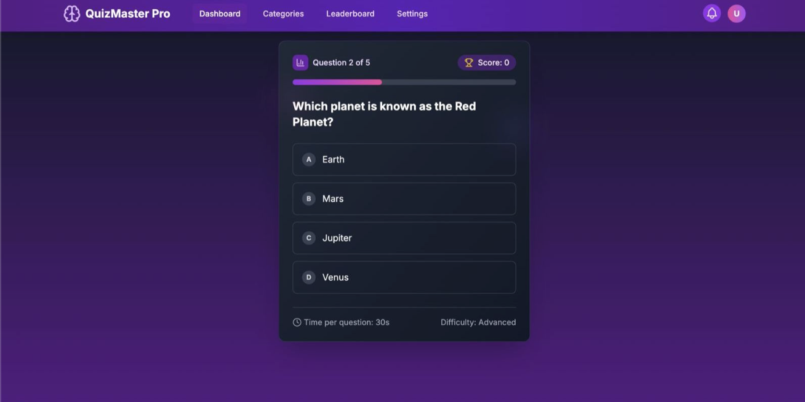
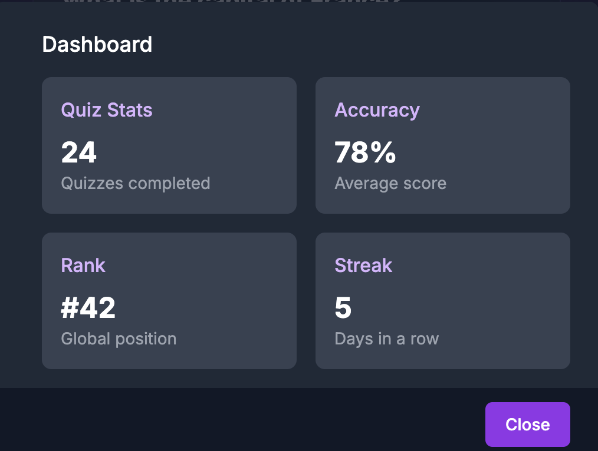
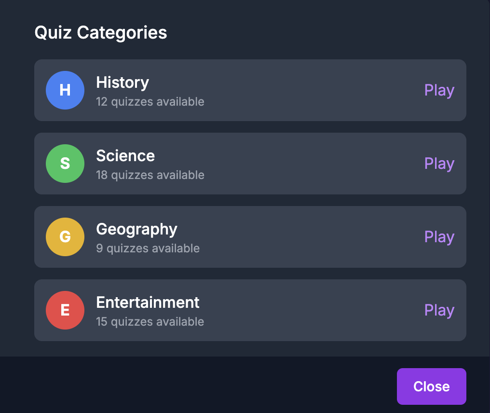
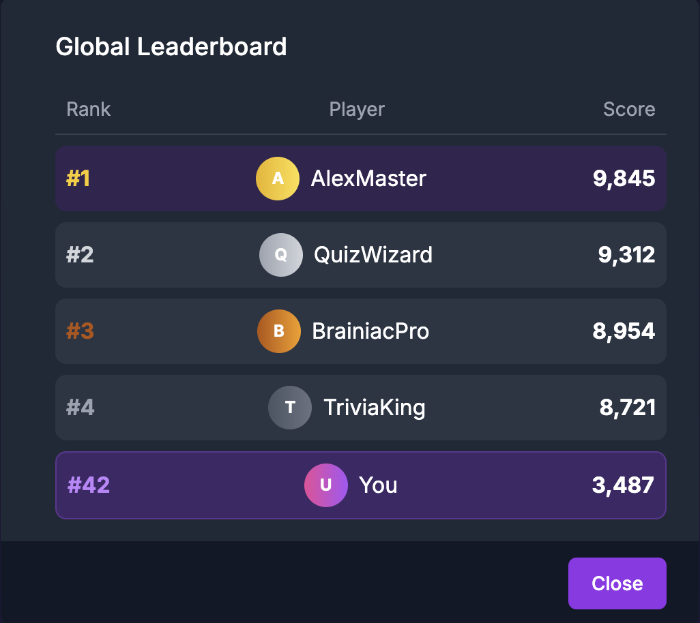
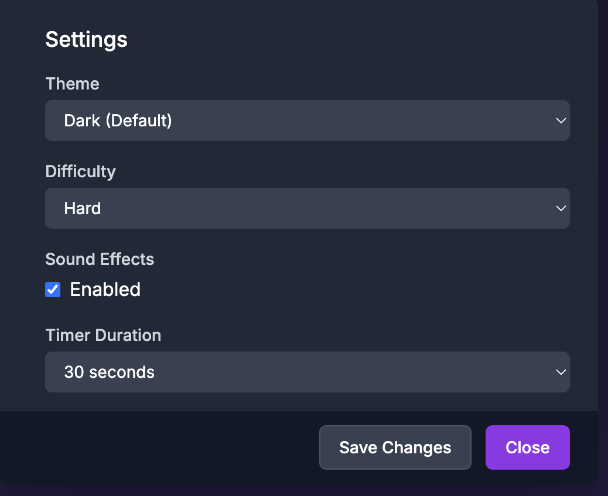
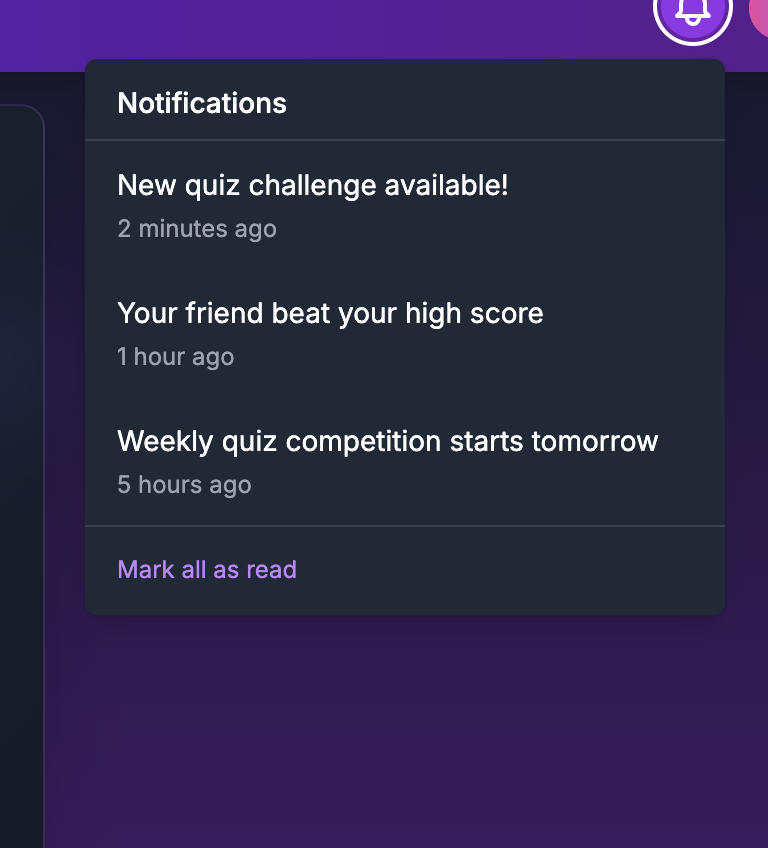
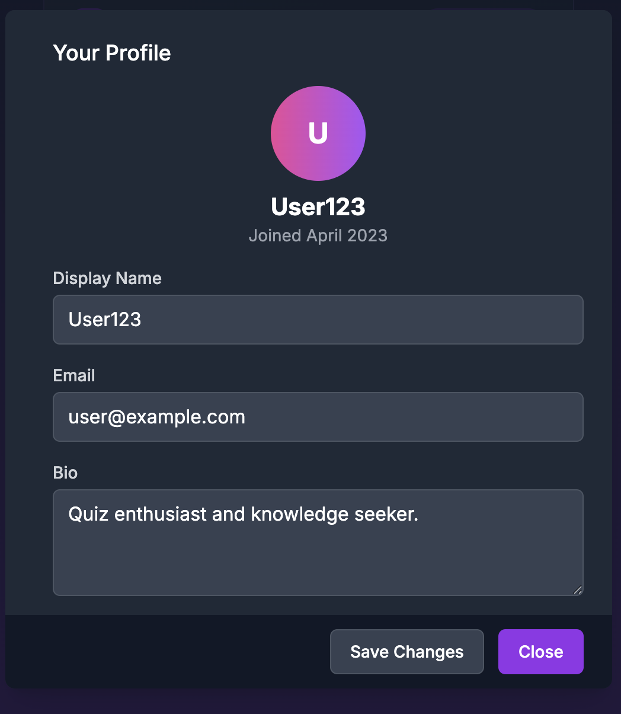

GDSC Tech Quiz App 🎯

Hello People, A Very Warm Welcome My Project is  under the Frontend - Interactive Quiz Application domain.

Welcome to the GDSC Tech Quiz App — a dynamic, fun, and interactive quiz application built using modern web technologies!

Deployed here 👉 https://gdg-quiz-ny6b6hys7-anushka-guptas-projects-ef0a3990.vercel.app/

📋 Project Overview
This is a Single Page Application (SPA) built using React.js that presents users with a multiple-choice quiz. The app tracks the user's score, provides immediate feedback after each question, and displays the final results upon completion. It is cleanly designed, fully responsive, and fulfills all the recruitment task requirements.

🚀 Features Implemented
Dynamic Quiz System: Displays questions with multiple-choice options from an internal dataset and accepts user input.

Progress and Score Tracking: Tracks current question number, user selections, and calculates the final score.

Immediate Feedback: Provides real-time feedback after each answer submission.

Quiz Completion Summary: Shows final results and performance summary at the end of the quiz.

Restartable and Responsive UI: Clean, modern interface allowing users to restart the quiz easily, built with responsive design principles.

🛠️ Tech Stack
Frontend Framework: React.js (v19)

Other Tools:

HTML5

CSS3

JavaScript (ES6+)

Deployment: Vercel

📂 How to Run Locally on your System: ( Works for Both Mac & Windows)

# 1. Clone the repository
git clone https://github.com/anushkag21/GDSC-Tech-QuizApp.git

# 2. Move into the project directory
cd GDSC-Tech-QuizApp

# 3. Install dependencies
npm install

# 4. Start the development server
npm start

🌐 Live Deployment
This project has been deployed for bonus points.
👉 View Live App Here

📸 Screenshots

Some Imp Points:
All functionalities mentioned in the problem statement are completed.

The code is original and free from any plagiarism.

Screenshots of the working app are added to the repository as required.

Know the Developer!!
Anushka Gupta

GitHub: anushkag21

Email: er.anushkagupta@gmail.com

Thank you! for reviewing my project submission!
